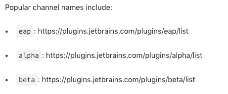
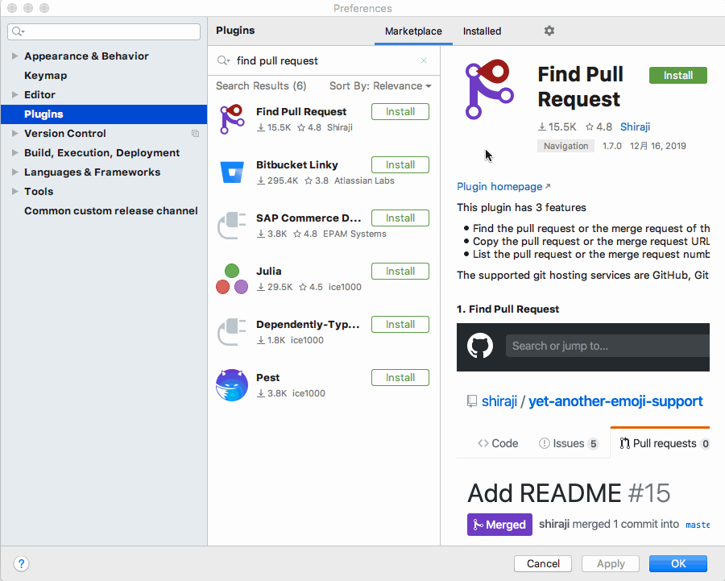

# common-custom-channel

How many times you google "intellij plugin beta url" and find this link?



This plugin helps you to set/unset common custom repository channels, super easily. All you need to do is select and apply!



## How to use

* Open preferences
* Select `Common custom release channel`
* Select/Unselect whatever you want to use as custom release channels
* Click OK

In order to refresh plugin search results, please reopen preferences dialog

## Limitation

Currently, I don't have an idea that how to refresh plugin search result after changing release channel using this menu.

## How to install

Use the IDE's plugin manager to install the latest version of the plugin.

## License

```
Copyright 2019 Yoshinori Isogai

Licensed under the Apache License, Version 2.0 (the "License");
you may not use this file except in compliance with the License.
You may obtain a copy of the License at

   http://www.apache.org/licenses/LICENSE-2.0

Unless required by applicable law or agreed to in writing, software
distributed under the License is distributed on an "AS IS" BASIS,
WITHOUT WARRANTIES OR CONDITIONS OF ANY KIND, either express or implied.
See the License for the specific language governing permissions and
limitations under the License.
```